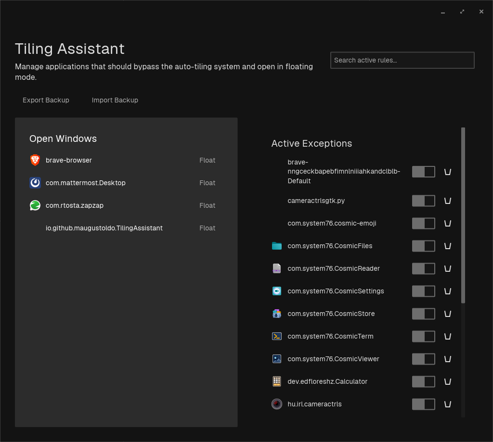

# Tiling Assistant

**Tiling Assistant** is a native GUI utility built with `libcosmic` specifically designed for the COSMIC Desktop Environment (Pop!_OS). It provides an elegant way to manage window auto-tiling exceptions, allowing you to easily configure specific applications to bypass Wayland's auto-tiling mechanism and open in floating mode automatically.



## Features

* **Native COSMIC integration:** Built with the official `libcosmic` library, adhering to the system's design language, themes (dark/light), and aesthetics.
* **Intelligent Auto-Refresh:** Instantly and silently fetches all currently open windows and their `app_id`s in the background, without requiring manual reloads.
* **One-Click Exceptions:** Transform any open window into a floating exception with a single click.
* **Toggle Rules:** Temporarily enable or disable floating rules using native switches without losing your configuration.
* **Backup Management:** Export and import your entire list of rules (`.ron` format) to easily sync your workspace settings across multiple machines.

---

## Installation

Go to the [Releases](https://github.com/maugustoldo/tiling-assistant/releases) page and download the installer that matches your system:

### Debian / Ubuntu / Pop!_OS (`.deb`)
```bash
sudo apt install ./tiling-assistant_*.deb
```

### Fedora (`.rpm`)
```bash
sudo dnf install ./tiling-assistant-*.rpm
```

### Fedora Atomic / Universal (`.AppImage`)
Simply make it executable and run (perfect for immutable systems as it avoids layering conflicts):
```bash
chmod +x tiling-assistant-x86_64.AppImage
./tiling-assistant-x86_64.AppImage
```

---

## How to Use

### Adding an Exception (Making an app float)
1. Open the application you want to make floating (e.g., Calculator, System Settings).
2. Open the **Tiling Assistant**.
3. Your active windows will automatically appear on the left panel ("Open Windows").
4. Find the application in the list and click **Float**.
5. It will immediately be moved to the "Active Exceptions" column on the right. The next time you open this app, it will bypass tiling and float!

### Managing Exceptions
To temporarily disable a rule, click the native **Switch (Toggle)** next to the app in the "Active Exceptions" column. To delete the rule entirely, click the **Trash** icon.

### Exporting and Importing Backups
If you have a complex set of rules and want to back them up or share them with another machine:
1. Click **Export Backup**. A native file dialog will open.
2. Choose where to save your `.ron` (Rust Object Notation) configuration file.
3. To restore them later, click **Import Backup** and select your saved `.ron` file. Your exceptions will be instantly loaded and applied!

---

## Building from source

Ensure you have Rust and the COSMIC development libraries installed (Wayland, xkbcommon).
```bash
git clone https://github.com/maugustoldo/tiling-assistant.git
cd tiling-assistant
cargo build --release
```
